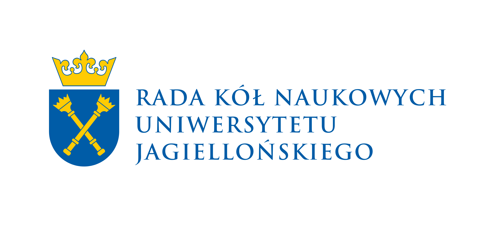
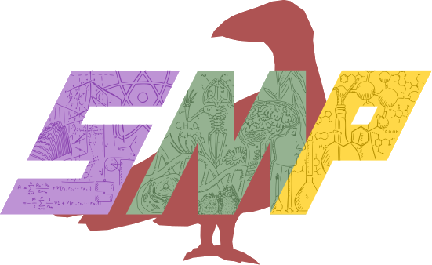

# Warsztaty LaTeXa 2024

**6-7 grudnia 2024**

_Kto pisze w Wordzie, temu śmierdzi w mordzie_

## Program

Rejestracja: gdzieś na parterze

Warsztaty: aula A-1-06

### Piątek, 6 grudnia

* **15:40 - 16:00** Rejestracja :elephant:
* **16:00 - 16:20** Wprowadzenie _Jakub Czartowski_ :fox_face:
* **16:30 - 17:30** Podstawy _Szymon Łysik_ :sloth:
* **17:40 - 19:10** [Tryb matematyczny](tryb%20matematyczny) _Dominik Piasecki_ :duck:
* **19:20 - 20:00** [Tabele](tabele) _Gabriel Ostrzołek_ :horse:
* **20:10 - 20:55** [Grafika](grafika) _Mateusz Winiarski_ :penguin:

### Sobota, 7 grudnia

* **10:30 - 11:20** CircuiTi*k*z _Wiktor Zantowicz_ :boar:
* **11:30 - 12:10** Bibliografia _Patryk Liniewicz_ :parrot:
* **12:20 - 13:20** [Prezentacje](https://github.com/KrzysztofProscinski/LaTeX) _Krzysztof Prościński_ :lady_beetle:
* **13:20 - 14:00** πzza :pie:
* **14:10 - 15:40** [Ti*k*z (🦆)](tikz) _Mateusz Winiarski_ :penguin:
* **15:50 - 16:30** [Plakaty](Plakaty) _Dawid Zapolski_ :otter:

## Partnerzy

 

Wydarzenie współfinansowane przez Radę Kół Naukowych Uniwersytetu Jagiellońskiego

 

Wydarzenie współorganizowane przez Koło Matematyczno-Przyrodnicze Studentów Uniwersytetu Jagiellońskiego